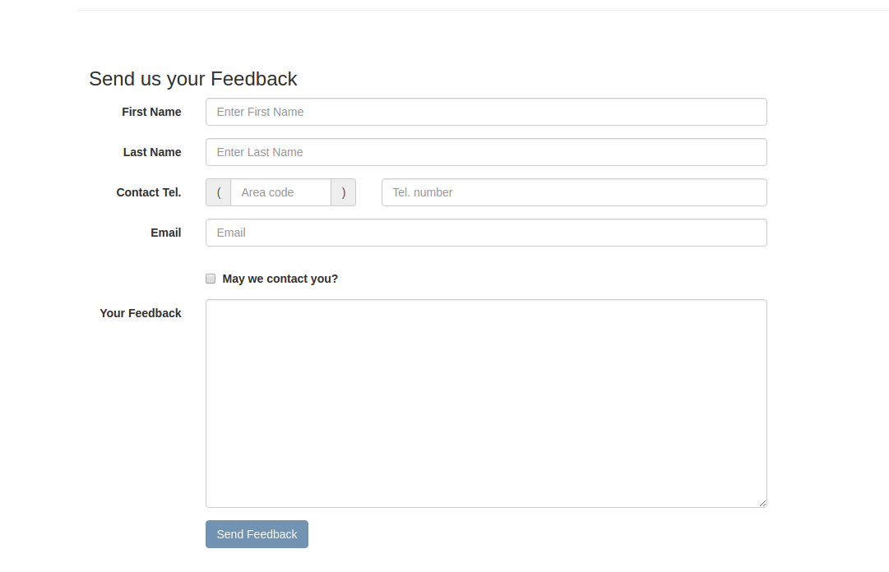
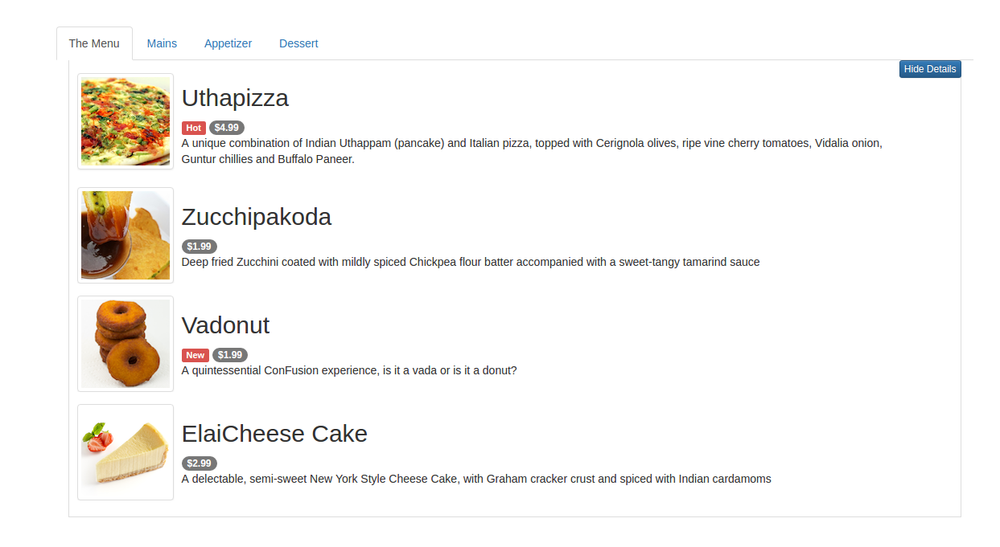
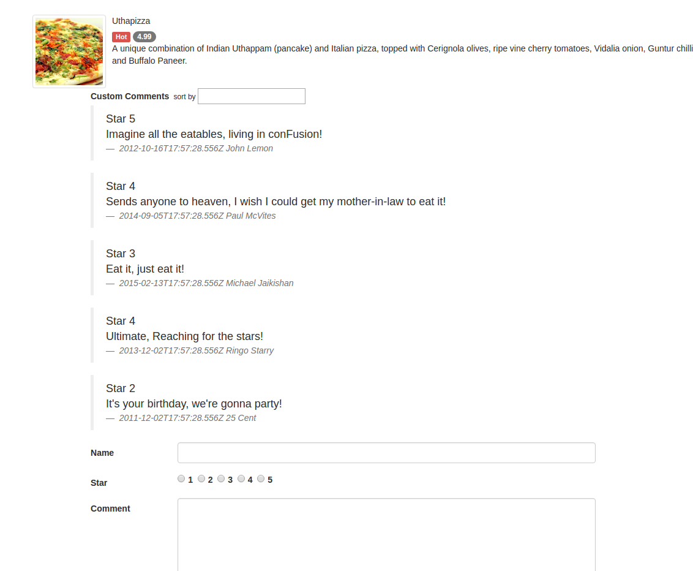

# Angular-web-application
use AngularJS framework to realize the data presentation and form validation.(i.e.contactus.html,menu.html,dishdetail.html)
as well as simple post like function after submiting comment.

